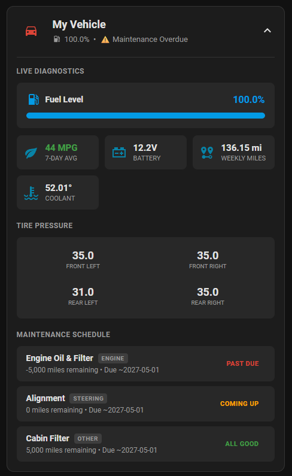

# Fleet Maintenance Card

A custom Lovelace card for Home Assistant to track your vehicle maintenance. 

⚠️ **IMPORTANT PREREQUISITE** ⚠️
This card is the frontend companion to the **Fleet Maintenance OS**. It will not function unless the backend database and add-on are installed. 
* 👉 **[Click here to install the Fleet Maintenance OS Add-on / Docker container](https://github.com/officialxndr/fleet-maintenance-addon)**

---

## Installation via HACS

1. Open Home Assistant and navigate to **HACS**.
2. Click on **Frontend**.
3. Click the three dots (`...`) in the top right corner and select **Custom repositories**.
4. Paste the URL of this repository: `https://github.com/officialxndr/fleet-maintenance-card`
5. Select **Lovelace** as the Category and click **Add**.
6. Close the modal, find **Fleet Maintenance Card** in the list, and click **Download**.
7. When prompted, reload your browser.

## Manual Configuration
If HACS doesn't automatically add the resource, go to **Settings > Dashboards > Click the three dots top right > Resources** and add:
* **URL:** `/hacsfiles/fleet-maintenance-card/fleet-maintenance-card.js`
* **Resource Type:** `JavaScript Module`